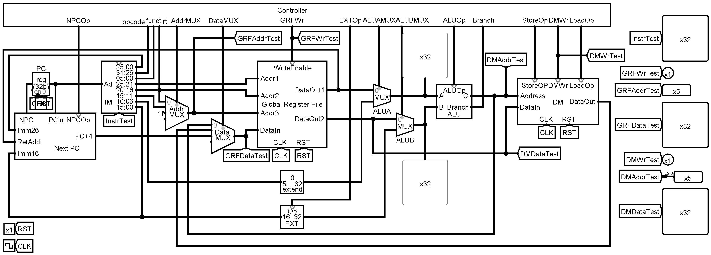

# Pipelined-MIPS-CPU
Course Project for Computer Organization

---

This MIPS CPU has a 5-stage full-speed forwarding pipeline and supports 50 instructions. The source code is at `Verilog/PipelineMipsCPU`. Sorry the [docs](Docs) are temporarily only available in Chinese.

The following figure shows my implementation of a single-cycle CPU in [Logisim](Logisim). The 5-stage full-speed forwarding pipeline CPU is implemented in [Verilog](Verilog). [MIPS-Assembly](MIPS-Assembly) programs validate the CPU's correctness.

